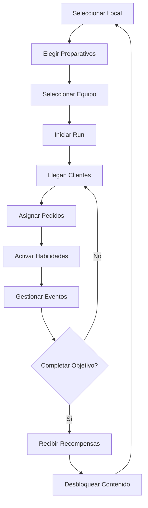
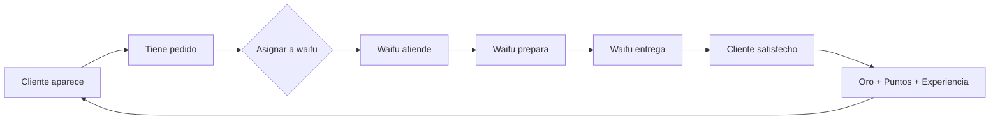
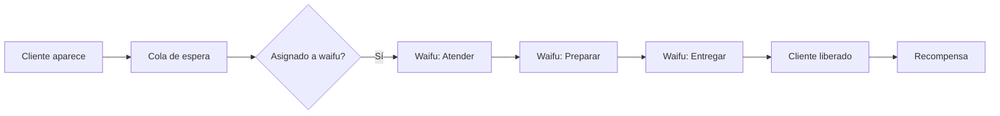
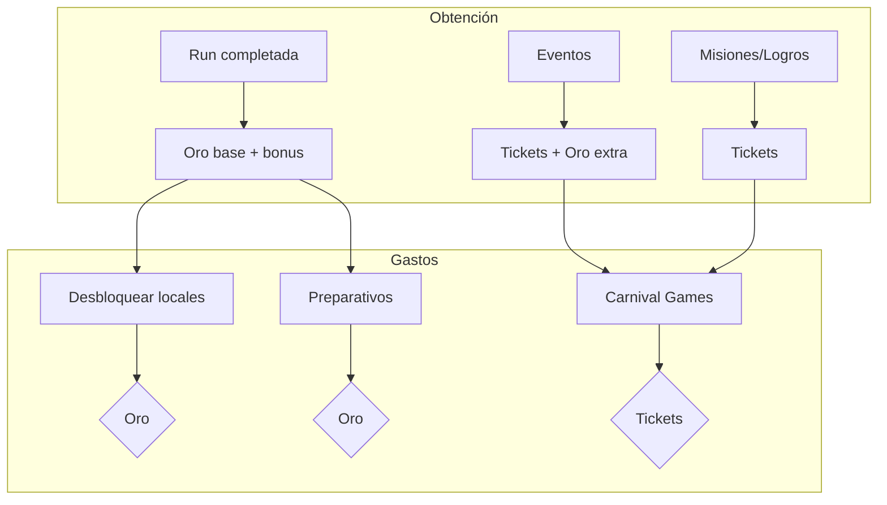
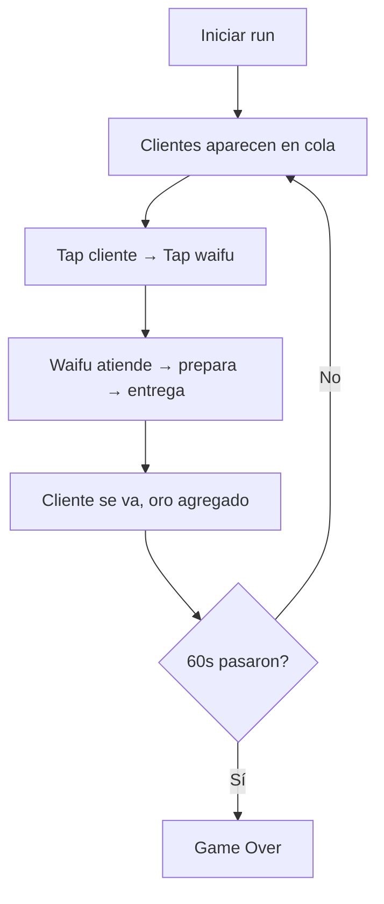

# WaifuCafe — Game Design Document

| Campo | Valor |
|-------|-------|
| **Título** | WaifuCafe: Anime Café Manager |
| **Versión** | v2.0 — Delta (Junio 2026) |
| **Género** | Gestión táctica ligera / Café Manager |
| **Plataforma** | PC (Unity) |
| **Estado** | En desarrollo activo — ~30% del diseño implementado |
| **Audiencia** | Fans de juegos de gestión, colección waifu, sesiones cortas (~10-15 min por run) |

---

## Índice

1. [High Concept](#1-high-concept)
2. [Pilares de Diseño](#2-pilares-de-diseño)
3. [Core Loop](#3-core-loop)
4. [Sistema de Waifus](#4-sistema-de-waifus)
5. [Sistema de Clientes](#5-sistema-de-clientes)
6. [Sistema de Locales](#6-sistema-de-locales)
7. [Sistema de Gacha](#7-sistema-de-gacha)
8. [Sistema de Eventos y Preparativos](#8-sistema-de-eventos-y-preparativos)
9. [Economía](#9-economía)
10. [Mapa de Implementación](#10-mapa-de-implementación)
11. [MVP — Loop Mínimo Funcional](#11-mvp--loop-mínimo-funcional)

---

## 1. High Concept

**WaifuCafe** es un juego de gestión táctica ligera donde el jugador dirige distintos cafés temáticos utilizando equipos de waifuas con habilidades únicas. Cada partida se divide en **runs cortas** (~3-5 minutos) donde llegan clientes, se asignan pedidos, se activan habilidades y se gestionan eventos en tiempo real. Entre runs, el jugador colecciona nuevas waifus, desbloquea historias, obtiene outfits, adquiere nuevos locales y experimenta con composiciones de equipo. La progresión es **horizontal** (más opciones, más variedad) en lugar de vertical (más poder), incentivando la rotación constante de estrategias.

---

## 2. Pilares de Diseño

| # | Pilar | Explicación |
|---|-------|-------------|
| 1 | **Café Vivo** | El café nunca está quieto. Clientes entrando y saliendo, waifus trabajando, mesas ocupándose, animaciones constantes. El jugador siente que el café respira. |
| 2 | **Decisiones Rápidas** | Cada acción del jugador debe tomar **1-2 segundos**. No hay pausa para pensar — la presión temporal es parte de la experiencia. Asignar un cliente a una waifu es un tap, activar una habilidad es otro tap. |
| 3 | **Colección Primero** | La motivación principal es **conseguir waifus nuevas**, descubrir sus historias, desbloquear outfits alternativos, y experimentar con composiciones. La colección impulsa la progresión, no el power creep. |
| 4 | **Rotación Constante** | No existe el equipo perfecto permanente. Eventos, objetivos de run, contratos, sinergias de local y bonificaciones por afinidad cambian constantemente qué waifus son óptimas. El jugador rota su equipo activo en cada run. |

---

## 3. Core Loop

### Flujo principal



### Loop interno (run activa)



### Ciclo por run

1. **Preparación** (~30s): Elegir local (si está desbloqueado), comprar preparativos consumibles, armar equipo de 4 waifus.
2. **Run activa** (~3-5 min): Clientes aparecen, el jugador asigna pedidos, waifus procesan, se activan habilidades, ocurren eventos.
3. **Resultados** (~15s): Puntuación, recompensas, desbloqueos, progreso de misiones.
4. **Meta** (entre runs): Invertir oro en locales, tirar gacha, subir afinidad, leer historias.

---

## 4. Sistema de Waifus

### 4.1 Estructura base

Cada waifu tiene 4 ejes principales:

| Atributo | Descripción | Ejemplos |
|----------|-------------|----------|
| **Especialidad** | Rol en la jugabilidad | Velocidad, VIP, Combos, Paciencia, Propinas, Eventos |
| **Talento** | 1 habilidad activa exclusiva (única por waifu) | Rush Time, Freeze Patience, Double Tips, Instant Delivery |
| **Afinidad** | Temática visual y de sinergia | Maid, Witch, Idol, Catgirl, Fox, Angel, Demon, Princess |
| **Sinergias** | Bonificaciones por composición de equipo | +Velocidad, +Propinas, +VIP, etc. |

### 4.2 Especialidades

| Especialidad | Efecto base |
|--------------|-------------|
| **Velocidad** | Procesa pedidos más rápido |
| **VIP** | Bonificación extra al atender clientes VIP |
| **Combos** | Aumenta el multiplicador de combos |
| **Paciencia** | Los clientes atendidos por esta waifu pierden paciencia más lento |
| **Propinas** | Genera oro adicional por pedido completado |
| **Eventos** | Reduce el impacto negativo de eventos o aumenta el positivo |

### 4.3 Talentos (habilidades activas)

Cada waifu tiene **exactamente 1 talento** activable durante la run. Tiempo de reutilización (cooldown) variable.

| Talento | Efecto | Cooldown |
|---------|--------|----------|
| **Rush Time** | Todos los clientes pierden paciencia un 50% más lento por 10s | 30s |
| **Freeze Patience** | Congela la paciencia de todos los clientes por 5s | 45s |
| **Double Tips** | Duplica las propinas por 8s | 40s |
| **Instant Delivery** | Completa el pedido actual al instante | 60s |
| **VIP Magnet** | El siguiente cliente que aparece es VIP | 35s |
| **Combo Booster** | El próximo combo cuenta como +2 pedidos extras | 50s |

### 4.4 Afinidades y Sinergias

La composición del equipo activo (4 waifus) determina las sinergias activas.

**Sinergias por mismas afinidades:**

| Composición | Bonus |
|-------------|-------|
| 2x misma afinidad | +10% velocidad |
| 3x misma afinidad | +15% velocidad + bonus secundario temático |
| 4x misma afinidad | +25% velocidad + bonus principal temático |

**Sinergias mixtas:**

| Composición | Bonus |
|-------------|-------|
| Maid + Idol | Mayor probabilidad de clientes VIP |
| Witch + Catgirl | Clientes más pacientes |
| Angel + Demon | Duplica duración de eventos positivos, reduce negativos |
| Fox + Princess | +20% propinas |

**Afinidades y sus bonus completos:**

| Afinidad | 2x bonus | 3x bonus | 4x bonus |
|----------|----------|----------|----------|
| Maid | +Velocidad | +Velocidad +Paciencia | Café eficiente extremo |
| Witch | +Eventos | +Eventos +Combos | Eventos siempre positivos |
| Idol | +VIP | +VIP +Propinas | Clientes VIP en cadena |
| Catgirl | +Paciencia | +Paciencia +Velocidad | Clientes nunca se enojan |
| Fox | +Propinas | +Propinas +VIP | Todo cliente da propina extra |
| Angel | +Eventos positivos | +Eventos +Paciencia | Eventos negativos anulados |
| Demon | +Combos | +Combos +Velocidad | Combos infinitos por 5s |
| Princess | Todo +10% | Todo +15% | Todo +25% (generalista) |

### 4.5 Equipo activo

- **Tamaño**: 4 waifus por run.
- **Todas pueden**: Atender clientes, procesar pedidos, activar habilidades.
- **No hay roles fijos**: Cualquier waifu puede hacer cualquier tarea, pero las especialidades potencian ciertas acciones.
- **Rotación**: El equipo se configura antes de cada run. No hay penalización por cambiar.

### 4.6 Progresión de waifus (futuro)

| Sistema | Descripción | Estado |
|---------|-------------|--------|
| Nivel | Subir de nivel mejora estadísticas base | ❌ No implementado |
| Afinidad | Subir afinidad desbloquea diálogos, historias | ❌ No implementado |
| Outfits | Skins alternativas, cambian visual y pueden modificar especialidad | ❌ No implementado |
| Historias | Escenas por waifu al subir afinidad | ❌ No implementado |

> **Nota de implementación**: Actualmente no existe ningún sistema de waifus en el código. No hay modelo de datos, ni selección, ni especialidades, ni talentos, ni afinidades. Es el sistema más grande por construir.

---

## 5. Sistema de Clientes

### 5.1 Tipos de cliente

| Tipo | Comportamiento | Recompensa base |
|------|----------------|-----------------|
| **Regular** | Paciencia estándar, pedido simple | Oro base |
| **VIP** | Paciencia reducida, paga más, da más puntos de experiencia | 2x oro, 2x exp |
| **Combo** | Su pedido puede encadenarse con otros iguales | Multiplicador de cadena |
| **Impaciente** (variante) | Paciencia mucho menor, pero da bonus si se atiende rápido | Oro +30% |

### 5.2 Sistema de paciencia

- Cada cliente tiene una barra de paciencia que se reduce con el tiempo.
- **Si llega a 0**: El cliente se va insatisfecho. Penalización en puntuación final.
- **Clientes VIP**: Pierden paciencia más rápido pero dan más recompensa.
- **Clientes Combo**: Paciencia normal, pero si se van, rompen la cadena activa.

Factores que afectan la paciencia:

| Factor | Efecto |
|--------|--------|
| Waifu con especialidad Paciencia | Reduce pérdida de paciencia en clientes asignados |
| Talento Freeze Patience | Congela toda pérdida por 5s |
| Talento Rush Time | Reduce pérdida en 50% por 10s |
| Evento positivo | Recupera algo de paciencia |
| Evento negativo | Acelera pérdida |

### 5.3 Flujo de atención



### 5.4 Estado de implementación

| Componente | Estado |
|------------|--------|
| Spawn de clientes | ✅ Implementado |
| Cola de espera | ✅ Implementado |
| Sistema de paciencia | ✅ Implementado |
| Asignación manual (drag & drop) | ✅ Implementado |
| Asignación automática | ❌ Roto (TODO en StaffManager) |
| Tipos de cliente (enum) | 🔶 Stub: solo Regular/VIP/Impatient |
| Clientes Combo | ❌ No implementado |
| Sistema de satisfacción | ❌ No implementado |
| Clientes repitiendo visita | ❌ No implementado |

---

## 6. Sistema de Locales

### 6.1 Concepto

Los locales son **coleccionables**, no progresión lineal. Cada local se desbloquea permanentemente con oro y ofrece bonificaciones únicas que cambian la forma de jugar. El jugador elige qué local usar antes de cada run.

### 6.2 Lista de locales

| Local | Costo | Bonificación | Estilo de juego |
|-------|-------|--------------|-----------------|
| **Maid Café** | Gratis (inicial) | +Paciencia en todos los clientes | Partidas relajadas, principiante |
| **Chinese Restaurant** | 10,000 oro | +Recompensas de combo | Incentiva encadenar pedidos |
| **Idol Café** | 50,000 oro | +VIP frecuentes, +Propinas | Alto riesgo, alta recompensa |
| **Halloween Café** | 150,000 oro | +Eventos, efectos más extremos | Caos controlado, runs impredecibles |

### 6.3 Estado de implementación

| Componente | Estado |
|------------|--------|
| Modelo de datos de locales | ❌ No implementado |
| Desbloqueo con oro | ❌ No implementado |
| Bonificaciones por local | ❌ No implementado |
| Selección de local pre-run | ❌ No implementado |
| UI de selección | ❌ No implementado |

---

## 7. Sistema de Gacha

### 7.1 Concepto

El sistema de **Carnival Games** es la mecánica gacha del juego. Son minijuegos que se juegan con Tickets (obtenidos por eventos, misiones, logros). NO se usa dinero real.

### 7.2 Minijuegos disponibles

| Minijuego | Mecánica | Costo |
|-----------|----------|-------|
| **Balloon Festival** | Explota globos para revelar premio | 1 ticket |
| **Dart Throw** | Apunta y lanza, precisión determina rareza | 2 tickets |
| **Capsule Machine** | Gacha clásico de cápsulas, animación de revelado | 1 ticket |
| **Target Practice** | Secuencia de blancos, puntería + reflejos | 3 tickets |

### 7.3 Premios

| Rareza | Probabilidad | Ejemplos |
|--------|-------------|----------|
| **Común** | 50% | Fragmentos de waifu (x1), materiales menores |
| **Rara** | 30% | Fragmentos de waifu (x3), tickets extra, decoraciones |
| **Épica** | 15% | Waifu completa, outfit raro |
| **Legendaria** | 5% | Waifu exclusiva, outfit legendario, historia especial |

### 7.4 Duplicados

Los duplicados **no** dan poder extra (no power creep). En su lugar, se convierten en:

- Outfits alternativos
- Skins visuales
- Ilustraciones especiales
- Recuerdos para el álbum
- Fragmentos de historia

### 7.5 Estado de implementación

| Componente | Estado |
|------------|--------|
| Modelo de datos de gacha | ❌ No implementado |
| Minijuegos | ❌ No implementado |
| Tickets como moneda | ❌ No implementado |
| Sistema de fragmentos | ❌ No implementado |
| Conversión de duplicados | ❌ No implementado |
| UI de carnival | ❌ No implementado |

---

## 8. Sistema de Eventos y Preparativos

### 8.1 Eventos runtime

Ocurren **durante la run** de forma aleatoria. Cada evento tiene duración limitada y efecto inmediato.

| Evento | Efecto | Duración | Probabilidad |
|--------|--------|----------|-------------|
| **Lunch Rush** | +50% clientes, todos pierden paciencia más rápido | 20s | 15% |
| **Machine Failure** | Una waifu no puede trabajar por 10s | 10s | 10% |
| **Influencer Visit** | Cliente VIP especial, si se atiende bien da bonus masivo | — | 8% |
| **Festival Day** | Todos los clientes dan doble recompensa | 30s | 5% |
| **Cat Invasion** | Gatos entran al café, clientes más felices (+paciencia) | 15s | 10% |
| **Power Outage** | Velocidad de todas las waifus reducida 50% | 10s | 8% |

### 8.2 Preparativos (pre-run)

Antes de cada run, el jugador puede comprar hasta **3 preparativos consumibles** (duran 1 run).

| Preparativo | Costo | Efecto |
|-------------|-------|--------|
| **VIP Ad** | 150 oro | Llegan más clientes VIP esta run |
| **Special Menu** | 200 oro | Mejora la recompensa base de cada pedido |
| **Maid Decoration** | 100 oro | +20% efectividad waifus afinidad Maid |
| **Speed Brew** | 180 oro | +15% velocidad de preparación para todas |
| **Patience Incense** | 120 oro | Todos los clientes empiezan con +25% paciencia |
| **Tip Jar** | 100 oro | +10% propinas por pedido |

### 8.3 Estado de implementación

| Componente | Estado |
|------------|--------|
| Eventos runtime | ❌ No implementado |
| Sistema de selección de eventos | ❌ No implementado |
| Preparativos pre-run | ❌ No implementado |
| UI de preparativos | ❌ No implementado |
| Consumibles y duración | ❌ No implementado |

---

## 9. Economía

### 9.1 Monedas

| Moneda | Símbolo | Cómo se obtiene | Usos principales |
|--------|---------|-----------------|------------------|
| **Oro** | 🪙 | Runs, propinas, misiones | Locales, preparativos, minijuegos |
| **Tickets** | 🎫 | Eventos, misiones, logros | Gacha (Carnival Games) |

### 9.2 Flujo económico



### 9.3 Costos referenciales

| Item | Costo | Moneda |
|------|-------|--------|
| Chinese Restaurant | 10,000 | 🪙 Oro |
| Idol Café | 50,000 | 🪙 Oro |
| Halloween Café | 150,000 | 🪙 Oro |
| VIP Ad (preparativo) | 150 | 🪙 Oro |
| Special Menu (preparativo) | 200 | 🪙 Oro |
| Balloon Festival | 1 | 🎫 Ticket |
| Dart Throw | 2 | 🎫 Ticket |
| Capsule Machine | 1 | 🎫 Ticket |
| Target Practice | 3 | 🎫 Ticket |

### 9.4 Estado de implementación

| Componente | Estado |
|------------|--------|
| Gold tracking | ✅ Implementado (RegardsManager) |
| Gold sinks | ❌ No implementado |
| Tickets | ❌ No implementado |
| Sistema de misiones | ❌ No implementado |
| Logros | ❌ No implementado |
| Balance económico | ❌ No definido |

---

## 10. Mapa de Implementación

### Leyenda

| Símbolo | Significado |
|---------|-------------|
| ✅ | **Completo** — Funcional, sin bugs conocidos |
| 🔶 | **Parcial** — Implementado pero incompleto o con bugs |
| ❌ | **No implementado** — No existe en el código base |

### Mapa completo

| # | Sistema | Estado | Detalle |
|---|---------|--------|---------|
| 1 | **Game Loop State Machine** | ✅ Completo | Estados Preparacion → Transicion → Game → GameOver funcionan. GameManager + GameStateMachine. |
| 2 | **Spawn de clientes** | ✅ Completo | CustomerQueue maneja spawn, cola, remoción, estadísticas. Timer-driven. |
| 3 | **Sistema de paciencia** | ✅ Completo | Barra de paciencia se reduce, cliente se va al llegar a 0. Funciona correctamente. |
| 4 | **Asignación manual (drag & drop)** | ✅ Completo | DragDropSystem + CustomerDropSlot + StaffServiceUIController. Tap cliente → tap waifu. |
| 5 | **State machine de staff** | ✅ Completo | Staff.cs con estados Atender → Preparar → Entregar. Pool de staff funciona. |
| 6 | **Gold tracking** | ✅ Completo | RegardsManager agrega oro. Sistema funcional. |
| 7 | **Cola de clientes** | ✅ Completo | FIFO queue con capacidad máxima. Manejo de prioridades no implementado. |
| 8 | **Staff pool management** | 🔶 Parcial | Pool funciona, pero StaffManager usa V1. V2/StaffMediatorComponent.UpdatePhase() está vacío. |
| 9 | **Tipos de cliente** | 🔶 Stub | Enum Regular / VIP / Impatient existe. Solo Regular tiene comportamiento real. |
| 10 | **Auto-assignment** | ❌ Roto | StaffManager.TryAssignCustomer() tiene corrutina comentada con TODO. No asigna nada en modo auto. |
| 11 | **Sistema de Waifus** | �No implementado | No existe modelo de datos, ni especialidades, ni talentos, ni afinidades, ni sinergias. |
| 12 | **Selección de equipo** | ❌ No implementado | No hay UI ni lógica para armar equipo de 4 waifus. |
| 13 | **Sistema de Locales** | ❌ No implementado | No existe concepto de venue en el código. |
| 14 | **Sistema de Gacha** | ❌ No implementado | No existe Carnival Games ni sistema de tickets. |
| 15 | **Sistema de Combos** | ❌ No implementado | No hay encadenamiento de pedidos. |
| 16 | **Eventos runtime** | ❌ No implementado | EventState en Phases.cs existe como enum pero no se usa. |
| 17 | **Preparativos pre-run** | ❌ No implementado | No hay sistema de consumibles ni loadout pre-run. |
| 18 | **Win/Lose conditions** | ❌ No implementado | Solo timer de 60s → GameOver. No hay objetivos variables. |
| 19 | **Puntuación** | ❌ No implementado | No hay sistema de score ni resultados de run. |
| 20 | **UI de menú principal** | ❌ No implementado | No hay flujo de menú, selección, preparación. |
| 21 | **UI de resultados** | ❌ No implementado | No hay pantalla de resultados post-run. |
| 22 | **Tests** | ❌ Ausente | 0 tests en el proyecto. |
| 23 | **Arquitectura V2** | 🔶 Incompleta | V2/Staff/ infraestructura creada pero vacía. V2/Customer/ directorio vacío. |

### Resumen visual

```
✅ Completo:    ████████ 7 sistemas (30%)
🔶 Parcial:     ███ 3 sistemas (13%)
❌ No impl:     ██████████████ 13 sistemas (57%)
```

---

## 11. MVP — Loop Mínimo Funcional

El MVP actual del juego (lo que **ya funciona** end-to-end) es:



### Lo que el MVP **no** tiene aún:

- ❌ No hay waifus con especialidades o habilidades
- ❌ No hay selección de local
- ❌ No hay preparativos
- ❌ No hay objetivos de run (solo timer)
- ❌ No hay sistema de win/lose (siempre termina en GameOver por tiempo)
- ❌ No hay puntuación ni recompensas variables
- ❌ No hay gacha, tickets, o progresión meta

### Próximo paso inmediato

Arreglar el auto-assignment (Fase 0 del roadmap). Sin eso, el juego solo funciona con control manual, lo que limita cualquier sistema futuro que requiera asignación automática.

---

> **Documento vivo** — Este GDD se actualiza a medida que se implementan sistemas. Última actualización: Junio 2026.
