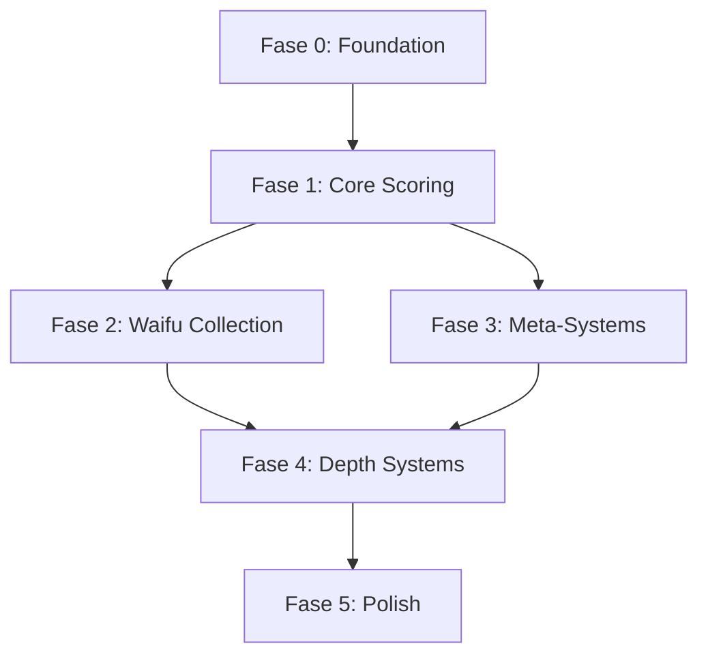
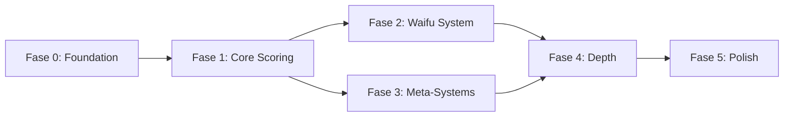

# WaifuCafe — Roadmap de Implementación

| Campo | Valor |
|-------|-------|
| **Versión** | v1.0 |
| **Fecha** | Junio 2026 |
| **Estado** | 7/23 sistemas completos (~30%) |
| **Próximo hito** | Fase 0: Arreglar bugs que bloquean el core loop |

---

## Índice

1. [Estado Actual](#1-estado-actual)
2. [Feature Completeness Matrix](#2-feature-completeness-matrix)
3. [Fases de Desarrollo](#3-fases-de-desarrollo)
4. [Dependencias entre Fases](#4-dependencias-entre-fases)
5. [Riesgos](#5-riesgos)

---

## 1. Estado Actual

### Resumen ejecutivo

WaifuCafe tiene una **base técnica sólida pero incompleta**. El core loop funciona end-to-end de forma manual: los clientes aparecen, el jugador los arrastra a una waifu, la waifu procesa el pedido, y el cliente se va. Sin embargo, hay **tres bugs críticos** y **~57% de los sistemas planificados no existen en el código**.

### Lo que funciona

- ✅ Game loop state machine (Preparacion → Transicion → Game → GameOver)
- ✅ Spawn y cola de clientes con sistema de paciencia
- ✅ Drag-and-drop manual para asignación cliente-waifu
- ✅ State machine de staff (Atender → Preparar → Entregar)
- ✅ Pool de staff funcional
- ✅ Gold tracking (RegardsManager)

### Lo que está roto

| Bug | Archivo | Impacto |
|-----|---------|---------|
| Auto-assignment: corrutina comentada con TODO | StaffManager.cs:104 | La asignación automática no hace nada. Staff nunca se asigna en modo auto. |
| V2 StaffMediatorComponent.UpdatePhase() vacío | V2/Staff/Infra/StaffMediatorComponent.cs | La state machine V2 de staff nunca avanza. |
| Tipos de cliente: enum existe pero sin comportamiento real | CustomerType.cs | VIP e Impatient existen pero se comportan como Regular. |

### Lo que falta

Los sistemas más grandes (Waifu, Locales, Gacha, Combos, Eventos, UI) **no existen en absoluto**. El proyecto necesita construir ~13 sistemas desde cero.

### Arquitectura

```
Assets/Scripts/
├── GameManager/         ✅ Core loop, state machine
├── Customers/           ✅ Spawn, queue, patience
├── Staff/               🔶 Pool funcional, auto-assignment roto
├── DragAndDrop/         ✅ Input, targets, UI bridges
├── V2/
│   ├── Staff/           🔶 Infraestructura creada, lógica vacía
│   └── Customers/       ❌ Directorio vacío
└── UI/                  ❌ Interfaces mínimas, sin sistema completo
```

---

## 2. Feature Completeness Matrix

### Todos los sistemas

| # | Sistema | Estado | ¿Qué falta? | Depende de |
|---|---------|--------|-------------|------------|
| 1 | Game Loop State Machine | ✅ Completo | — | — |
| 2 | Customer Spawn/Queue | ✅ Completo | — | — |
| 3 | Patience System | ✅ Completo | — | — |
| 4 | Manual Assignment (Drag & Drop) | ✅ Completo | — | — |
| 5 | Staff State Machine | ✅ Completo | — | — |
| 6 | Gold Tracking | ✅ Completo | — | — |
| 7 | Staff Pool Management | 🔶 Parcial | V2 UpdatePhase vacío | Fase 0 |
| 8 | Auto-Assignment | ❌ Roto | Corrutina comentada | Fase 0 |
| 9 | Customer Types | 🔶 Stub | Solo Regular funcional | Fase 0 |
| 10 | Win/Lose Conditions | �No existe | Objetivos variables, puntuación | Fase 1 |
| 11 | Scoring System | ❌ No existe | Puntos por run, combo, eficiencia | Fase 1 |
| 12 | Run Rewards | ❌ No existe | Recompensas variables post-run | Fase 1 |
| 13 | Results UI | ❌ No existe | Pantalla de resultados | Fase 1 |
| 14 | Waifu Data Model | ❌ No existe | Especialidades, talentos, afinidades | Fase 2 |
| 15 | Waifu Synergies | ❌ No existe | Bonificaciones por composición | Fase 2 |
| 16 | Team Selection | ❌ No existe | UI de armado de equipo | Fase 2 |
| 17 | Active Skills (Talents) | ❌ No existe | Habilidades activables durante run | Fase 2 |
| 18 | Venue System | ❌ No existe | Locales, desbloqueo, bonificaciones | Fase 3 |
| 19 | Gacha / Carnival Games | ❌ No existe | Minijuegos, tickets, fragmentos | Fase 3 |
| 20 | Duplicate System | ❌ No existe | Outfits, skins, historias | Fase 3 |
| 21 | Combo System | ❌ No existe | Encadenamiento de pedidos | Fase 4 |
| 22 | Runtime Events | ❌ No existe | Lunch Rush, Machine Failure, etc. | Fase 4 |
| 23 | Pre-run Preparations | ❌ No existe | Consumibles, loadout | Fase 4 |
| 24 | Economy Balance | ❌ No existe | Oro/tickets sinks, precios | Fase 4 |
| 25 | Full UI/UX | ❌ No existe | Menú, selección, resultados, settings | Fase 5 |
| 26 | Animations & VFX | ❌ No existe | Feedback visual, transiciones | Fase 5 |
| 27 | Unit / Integration Tests | ❌ Ausente | 0 tests en el proyecto | Fase 5 |

---

## 3. Fases de Desarrollo

### 📊 Diagrama de ruta



---

### Fase 0 — Foundation

**Prioridad: 🔴 CRÍTICA** | **Esfuerzo estimado: ~2-3 días**

Arreglar los bugs que impiden que el core loop funcione correctamente. Sin esto, construir sobre el codebase actual es construir sobre arena.

#### Tareas

| # | Tarea | Archivos afectados | Criterio de éxito |
|---|-------|--------------------|--------------------|
| 0.1 | **Arreglar auto-assignment en StaffManager** | StaffManager.cs | Descomentar y corregir `HandleServiceCoroutine` en `TryAssignCustomer`. Staff debe auto-asignarse cuando hay clientes en cola y staff disponible. |
| 0.2 | **Completar V2 Staff UpdatePhase()** | StaffMediatorComponent.cs | Implementar `UpdatePhase()` para que avance la state machine V2. Sincronizar con V1 si la V2 no está lista para reemplazarla. |
| 0.3 | **Habilitar comportamiento de Customer Types** | CustomerType.cs, CustomerQueue.cs | VIP debe tener paciencia reducida y dar más oro. Impatient debe tener paciencia mucho menor con bonus por atención rápida. |
| 0.4 | **Verificar end-to-end del game loop** | GameManager.cs, múltiples | El juego debe funcionar de principio a fin sin bugs: Preparacion → Game → GameOver → reinicio. |

#### Checklist de aceptación

- [ ] Auto-assignment funciona: staff agarra clientes de la cola automáticamente
- [ ] Staff procesa clientes correctamente (Atender → Preparar → Entregar)
- [ ] Clientes VIP dan más oro que Regulares
- [ ] Clientes Impatient se van más rápido pero dan bonus si se atienden rápido
- [ ] Game loop se puede reiniciar sin errores
- [ ] No hay regresiones en la asignación manual (drag & drop)

---

### Fase 1 — Core Scoring System

**Prioridad: 🟠 ALTA** | **Esfuerzo estimado: ~1 semana** | **Depende de: Fase 0**

El juego actualmente solo tiene un timer de 60s que termina en GameOver. No hay objetivos, ni victoria, ni puntuación, ni recompensas. Sin esto, no hay razón para jugar más de una run.

#### Tareas

| # | Tarea | Archivos afectados | Criterio de éxito |
|---|-------|--------------------|--------------------|
| 1.1 | **Diseñar modelo de objetivos de run** | Nuevo: ObjectiveSystem.cs | Sistema que selecciona 1-3 objetivos variables por run (ej: "Atiende 10 clientes", "Gana 500 oro", "No pierdas clientes"). |
| 1.2 | **Implementar Win/Lose conditions** | GameLoopState.cs, GameManager.cs | Si se cumple el objetivo antes del timer → Win. Si no → Lose (con progreso parcial). Si todos los clientes se van → Lose inmediato. |
| 1.3 | **Sistema de puntuación** | Nuevo: ScoreManager.cs | Puntos por cliente atendido, combo, eficiencia, bonus por dificultad. Score final basado en múltiples métricas. |
| 1.4 | **Sistema de recompensas** | RegardsManager.cs (extender) | Recompensas variables según puntuación: oro base + bonus, tickets (si existen), materiales. |
| 1.5 | **Pantalla de resultados** | Nuevo: ResultScreen.cs / UI | Mostrar puntuación, clientes atendidos/perdidos, oro ganado, objetivo cumplido, botón de continuar. |
| 1.6 | **Feedback de progreso en run** | UI existente / nueva | Indicador de tiempo restante, objetivo actual, clientes atendidos vs total, puntuación en vivo. |

#### Checklist de aceptación

- [ ] Cada run tiene al menos 1 objetivo variable
- [ ] Win: se muestra pantalla de victoria con recompensas
- [ ] Lose: se muestra pantalla de derrota con progreso parcial
- [ ] Puntuación se calcula y muestra correctamente
- [ ] Recompensas se otorgan según puntuación
- [ ] UI de resultados permite continuar / reiniciar

---

### Fase 2 — Waifu Collection System

**Prioridad: 🟠 ALTA** | **Esfuerzo estimado: ~2-3 semanas** | **Depende de: Fase 1**

El sistema más grande y el corazón del juego. Sin waifus con especialidades, talentos y sinergias, el juego es un café genérico sin personalidad.

#### Tareas

| # | Tarea | Archivos afectados | Criterio de éxito |
|---|-------|--------------------|--------------------|
| 2.1 | **Modelo de datos Waifu** | Nuevo: WaifuData.cs, WaifuDatabase.cs | ScriptableObject con: nombre, especialidad, talento, afinidad, nivel, estadísticas base. Base de datos de waifus disponibles. |
| 2.2 | **Sistema de especialidades** | WaifuData.cs, StaffManager.cs | Cada waifu tiene una especialidad que modifica su comportamiento: Velocidad, VIP, Combos, Paciencia, Propinas, Eventos. |
| 2.3 | **Sistema de talentos activos** | Nuevo: TalentSystem.cs | Habilidades activables por el jugador durante la run. Cooldown por waifu. Efectos temporales en gameplay. |
| 2.4 | **Sistema de afinidades y sinergias** | Nuevo: SynergySystem.cs | Composición del equipo (4 waifus) determina bonificaciones activas. Tabla de sinergias por afinidad. |
| 2.5 | **UI de selección de equipo** | Nuevo: TeamSelectionScreen.cs | Seleccionar 4 waifus de la colección antes de la run. Mostrar especialidades, talentos, sinergias activas. |
| 2.6 | **Integración con gameplay** | StaffManager.cs, StaffServiceUIController.cs | Waifus reemplazan a los staff genéricos. Especialidades afectan tiempos de proceso. Talentos activables desde UI de run. |
| 2.7 | **Gráficos de waifu placeholder** | Assets/Sprites/ | Sprites placeholder para cada afinidad (al menos 1 por tipo: Maid, Witch, Idol, Catgirl, Fox, Angel, Demon, Princess). |

#### Checklist de aceptación

- [ ] Se puede crear waifu con especialidad, talento y afinidad
- [ ] Se puede armar equipo de 4 waifus antes de la run
- [ ] Especialidades afectan el gameplay (velocidad, propinas, etc.)
- [ ] Talentos se pueden activar durante la run con cooldown
- [ ] Sinergias se calculan y aplican según composición
- [ ] UI muestra información relevante de cada waifu

---

### Fase 3 — Meta-Systems

**Prioridad: 🟡 MEDIA** | **Esfuerzo estimado: ~2 semanas** | **Depende de: Fase 1**

Sistemas de progresión entre runs. Locales desbloqueables y sistema gacha dan sentido a la economía y la colección.

#### Tareas

| # | Tarea | Archivos afectados | Criterio de éxito |
|---|-------|--------------------|--------------------|
| 3.1 | **Modelo de datos de Locales** | Nuevo: VenueData.cs | ScriptableObject con: nombre, costo, bonificaciones, requisitos. 4 venues iniciales. |
| 3.2 | **Sistema de desbloqueo** | Nuevo: VenueManager.cs | Comprar locales con oro. Locales desbloqueados permanentemente. Selección pre-run. |
| 3.3 | **Bonificaciones de local activas** | GameManager.cs | El local seleccionado aplica sus bonificaciones durante la run (ej: Maid Café → +paciencia). |
| 3.4 | **UI de selección de local** | Nuevo: VenueSelectScreen.cs | Grid de locales desbloqueados/bloqueados. Previsualización de bonificaciones. Costo si está bloqueado. |
| 3.5 | **Sistema de Tickets** | Nuevo: TicketManager.cs | Tickets como segunda moneda. Obtención por eventos, misiones, logros. Gasto en gacha. |
| 3.6 | **MiniJuegos Carnival (Gacha)** | Nuevo: CarnivalSystem.cs | 4 minijuegos base: Balloon Festival, Dart Throw, Capsule Machine, Target Practice. Interacción mínima. |
| 3.7 | **Sistema de fragmentos y waifus** | Nuevo: GachaResultSystem.cs | Obtener waifus completas o fragmentos. Fragmentos combinables para crear waifu. Pity system. |
| 3.8 | **Sistema de duplicados** | Nuevo: DuplicateSystem.cs | Duplicados → outfits, skins, ilustraciones. Sin power creep. |

#### Checklist de aceptación

- [ ] Se puede comprar y desbloquear locales
- [ ] Las bonificaciones del local seleccionado se aplican en run
- [ ] UI muestra locales disponibles con costo y bonificaciones
- [ ] Tickets se ganan y gastan
- [ ] Minijuegos Carnival funcionan y entregan premios
- [ ] Fragmentos se combinan en waifus completas
- [ ] Duplicados se convierten en contenido cosmético

---

### Fase 4 — Depth Systems

**Prioridad: 🟢 BAJA** | **Esfuerzo estimado: ~2-3 semanas** | **Depende de: Fase 2 + Fase 3**

Sistemas que añaden profundidad estratégica: combos, eventos runtime, preparativos. Estos sistemas hacen que cada run sea única.

#### Tareas

| # | Tarea | Archivos afectados | Criterio de éxito |
|---|-------|--------------------|--------------------|
| 4.1 | **Sistema de Combos** | Nuevo: ComboSystem.cs | Pedidos similares consecutivos generan cadena. Multiplicador aumenta con longitud de cadena. Bonus: oro, exp, materiales. |
| 4.2 | **UI de combo** | Nuevo: ComboUI.cs | Indicador de cadena activa, multiplicador actual, bonus acumulado. Feedback visual al encadenar. |
| 4.3 | **Sistema de Eventos runtime** | Nuevo: EventManager.cs | Eventos aleatorios durante la run. Duración determinada. Efecto inmediato en gameplay. 6+ eventos definidos. |
| 4.4 | **UI de eventos** | Nuevo: EventUI.cs | Notificación de evento entrante, indicador de duración, efecto visible en gameplay. |
| 4.5 | **Sistema de Preparativos** | Nuevo: PreparationSystem.cs | Comprar hasta 3 preparativos pre-run. Consumibles (1 run). Efectos variados. |
| 4.6 | **UI de preparativos** | Nuevo: PreparationScreen.cs | Panel de selección pre-run. Mostrar costo, efecto, si ya está activo. |
| 4.7 | **Balance económico inicial** | Múltiples | Ajustar costos de locales, preparativos, recompensas de run, probabilidades de gacha. Tabla de balance. |

#### Checklist de aceptación

- [ ] Encadenar pedidos iguales genera combo con multiplicador
- [ ] Eventos ocurren aleatoriamente durante la run
- [ ] Eventos tienen efecto visible en gameplay
- [ ] Preparativos se pueden comprar y afectan la run
- [ ] Economía se siente balanceada (no demasiado lenta ni rápida)

---

### Fase 5 — Polish

**Prioridad: 🟢 BAJA** | **Esfuerzo estimado: ~3-4 semanas** | **Depende de: Fase 4**

La capa final de calidad. UI completa, animaciones, feedback visual, audio, tests. Es lo que transforma un prototipo funcional en un juego.

#### Tareas

| # | Tarea | Archivos afectados | Criterio de éxito |
|---|-------|--------------------|--------------------|
| 5.1 | **Menú principal** | Nuevo: MainMenu.cs | Pantalla de título, botones: Jugar, Colección, Tienda, Opciones. Transiciones a selección de local. |
| 5.2 | **UI de colección de waifus** | Nuevo: CollectionScreen.cs | Grid de waifus obtenidas, detalle al seleccionar, progreso de afinidad, outfits desbloqueados. |
| 5.3 | **Animaciones de waifus** | Staff prefabs, AnimationController | Idle, atender, preparar, entregar, activar talento. Al menos 2 frames por estado. |
| 5.4 | **Feedback visual para acciones** | Múltiples | Efecto al asignar cliente, al activar talento, al completar pedido, al encadenar combo. Partículas simples. |
| 5.5 | **Audio** | Nuevo: AudioManager.cs | Música de fondo por local, SFX para acciones principales. |
| 5.6 | **Sistema de logros** | Nuevo: AchievementSystem.cs | Logros básicos: "Atiende 100 clientes", "Completa 10 runs", "Desbloquea todos los locales". |
| 5.7 | **Tests unitarios** | Nuevo: Tests/ | Tests para sistemas core: CustomerQueue, StaffManager, ScoreManager, SynergySystem, ComboSystem. |
| 5.8 | **Tests de integración** | Nuevo: Tests/Integration | Tests de game loop completo, run simulada, escenarios de borde. |

#### Checklist de aceptación

- [ ] Menú principal funcional con todas las opciones
- [ ] Colección de waifus navegable
- [ ] Animaciones fluidas en todas las waifus
- [ ] Feedback visual claro para cada acción del jugador
- [ ] Audio presente (música + SFX)
- [ ] Logros se desbloquean y muestran
- [ ] Cobertura de tests >60% en sistemas core

---

## 4. Dependencias entre Fases

### Diagrama de dependencias



### Tabla de dependencias

| Fase | Depende de | Por qué |
|------|------------|---------|
| **Fase 0** | — | Es la base. Sin el auto-assignment funcionando, el juego no escala. |
| **Fase 1** | Fase 0 | Necesitas un game loop estable para medir puntuación. Sin staff funcional, el scoring no tiene sentido. |
| **Fase 2** | Fase 1 | Las waifus necesitan que exista un sistema de puntuación para que sus especialidades tengan impacto medible. Las habilidades activas necesitan un game loop funcional. |
| **Fase 3** | Fase 1 | Los locales y el gacha son sistemas meta que dependen de la economía de runs. Sin scoring/rewards, no hay incentivo para desbloquear contenido. |
| **Fase 4** | Fase 2 + Fase 3 | Los combos dependen del sistema de clientes. Los eventos afectan a waifus y clientes. Los preparativos son consumibles que requieren economía. |
| **Fase 5** | Fase 4 | El polish (UI, animaciones, tests) se construye sobre sistemas estables. No tiene sentido pulir lo que va a cambiar. |

### Bloques paralelizables

Dentro de cada fase, estas tareas **pueden hacerse en paralelo**:

| Fase | Tareas paralelizables |
|------|-----------------------|
| Fase 0 | 0.1 + 0.2 (distintos archivos) |
| Fase 1 | 1.3 (scoring) + 1.4 (rewards) + 1.5 (UI) |
| Fase 2 | 2.1 (modelo) + 2.2 (especialidades) + 2.3 (talentos) + 2.4 (sinergias) |
| Fase 3 | 3.1-3.4 (locales) + 3.5-3.8 (gacha) |
| Fase 4 | 4.1-4.2 (combos) + 4.3-4.4 (eventos) + 4.5-4.6 (preparativos) |

---

## 5. Riesgos

| # | Riesgo | Probabilidad | Impacto | Mitigación |
|---|--------|-------------|---------|------------|
| 1 | **Auto-assignment más roto de lo que parece** | Media | Alto — Fase 0 se extiende | No asumir que es solo descomentar. Revisar toda la cadena ServiceCoordinator → StaffManager antes de tocar. |
| 2 | **Arquitectura V1 vs V2 no resuelta** | Alta | Alto — decisiones futuras sobre base incorrecta | Decidir en Fase 0: ¿se migra a V2 o se arregla V1? No dejar ambas. |
| 3 | **Waifu system scope creep** | Alta | Medio — Fase 2 se alarga indefinidamente | MVP de waifus: solo modelo de datos + 1 especialidad funcional. Añadir talentos y sinergias en iteraciones. |
| 4 | **Sin tests → regresiones frecuentes** | Alta | Medio — cada fase rompe algo de la anterior | Agregar tests en Fase 0 para el core loop. Tests mínimos por cada PR. |
| 5 | **Gacha sin diseño de minijuegos** | Media | Medio — Fase 3 se vuelve costosa | MVP de gacha: Capsule Machine solo (el más simple). Diferir Balloon/Dart/Target a polish. |
| 6 | **Economía difícil de balancear** | Alta | Bajo — no bloquea, pero afecta retención | Balance inicial conservador. Ajustar por datos de playtesting. No iterar hasta Fase 4. |
| 7 | **Pérdida de momentum por fases largas** | Media | Medio — equipo se desmotiva | Dividir fases grandes (Fase 2) en sub-entregas con releases jugables. |

---

## Apéndice A: Resumen de esfuerzo

| Fase | Prioridad | Esfuerzo estimado | Sistemas nuevos | Dependencias |
|------|-----------|-------------------|-----------------|--------------|
| 0 — Foundation | 🔴 Crítica | 2-3 días | 0 | — |
| 1 — Core Scoring | 🟠 Alta | 1 semana | 4 | Fase 0 |
| 2 — Waifu Collection | 🟠 Alta | 2-3 semanas | 6 | Fase 1 |
| 3 — Meta-Systems | 🟡 Media | 2 semanas | 8 | Fase 1 |
| 4 — Depth Systems | 🟢 Baja | 2-3 semanas | 7 | Fase 2+3 |
| 5 — Polish | 🟢 Baja | 3-4 semanas | 8 | Fase 4 |
| **Total** | | **~12-16 semanas** | **33** | |

---

> **Documento vivo** — Este roadmap se actualiza con cada fase completada. Última actualización: Junio 2026.
